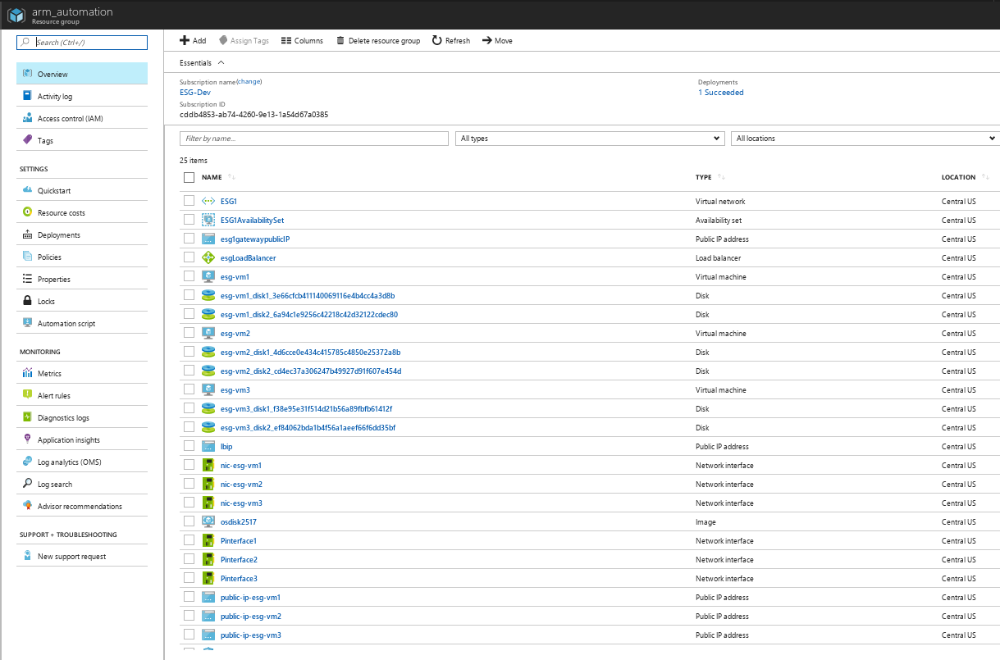

# Forcepoint Full ESG Azure Template


## Info
This is pretty particular to the ESG team's Azure setup, we'll work on making it more generic.


## Setup
- We expect an appliance image and a 255GB blank disk image to be deployed in your storage account.  The `esg_image_name` variable should match your filename.  If you have a newer version that changes the size of the disk, make sure to update the template.
- We expect the shared resources and load balancer templates to be uploaded in your storage account as a blob under `https://${storageAccountName}.blob.core.windows.net/esg1/templates/shared-resources.json` and `https://${storageAccountName}.blob.core.windows.net/esg1/templates/load-balancer.json`

We expect privateIp.sh to be deployed to your storage account's blob storage under `/scripts/` ... this is run by the Microsoft ARM External Script Extension after VM provisioning.

## Deployment

```bash
$ az login
$ az group create --name your_resource_group --location "Central US"
$ az group deployment create --resource group your_resource_group --template-file azuredeploy.json --parameters @parameters.json --name your_deployment_name
```

### A successful deployment looks like this:

