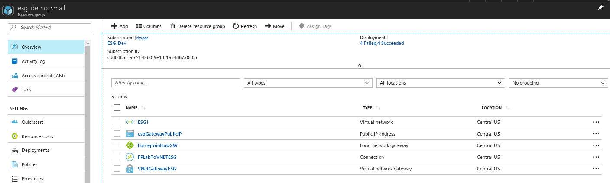

# Forcepoint Full ESG Azure Template


## Info
This is pretty particular to the ESG team's Azure setup, we'll work on making it more generic.


## Setup
- We expect an appliance image and a 255GB blank disk image to be deployed in your storage account.  The `esg_image_name` variable should match your filename.  If you have a newer version that changes the size of the disk, make sure to update the template.
- We expect a virtual network exists matching the name given in the paramaters.json file (the customer will have already established a virtual network with a site-to-site VPN connection established).



## Deployment

```bash
$ az login
$ az group create --name your_resource_group --location "Central US"
$ az group deployment create --resource group your_resource_group --template-file azuredeploy.json --parameters @parameters.json --name your_deployment_name
```
...or after logging in with an existing resource group:

```bash
$ ./deploy.sh resource_group_name
```

### What the template will create for you
- An image combining the VHD, OS disk, and data disk
- For each VM, 2 NICs and an OS disk and a data disk, one public IP for the primary NIC on each VM and a public IP for the load balancer
- If you choose more than one VM, a load balancer with each VM in the backpool and all VMs within an Availability Set.
- Network security groups
- Forwarding rules for the load balancer (i.e. port 25 -> port 25 on the VMs)

## Caveats
The Virtual network you create should have a GatewaySubnet with an address space that doesn't overlap with the other subnet(s) created by the template.
To make your life easy use: 172.18.0.0/16 as your VNet address space and 172.18.254.0/29 as your GatewaySubnet address space.

### A successful deployment looks like this:


