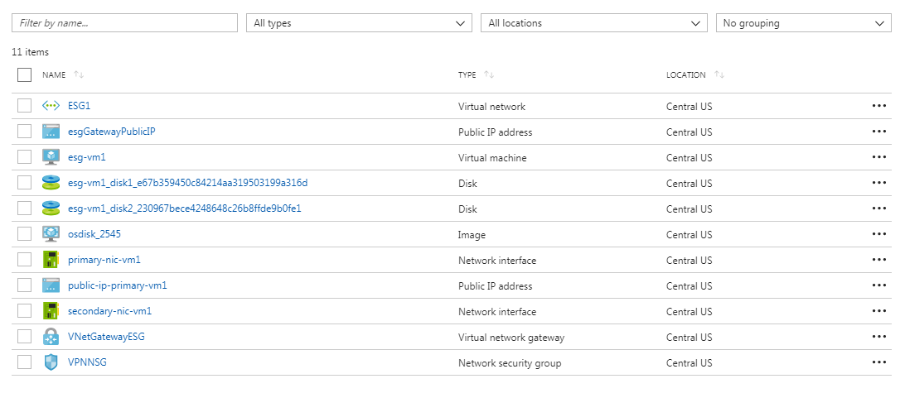
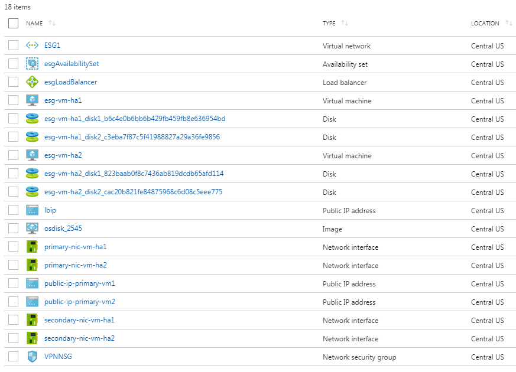

# Forcepoint Full ESG Azure Template


## Info
This is pretty particular to the ESG team's Azure setup, we'll work on making it more generic.


## Setup
- We expect an appliance image and a 255GB blank disk image to be deployed in your storage account.  The `esg_image_name` variable should match your filename.  If you have a newer version that changes the size of the disk, make sure to update the template.
- We expect the shared resources and load balancer templates to be uploaded in your storage account as a blob under `https://${storageAccountName}.blob.core.windows.net/esg1/templates/shared-resources.json` and `https://${storageAccountName}.blob.core.windows.net/esg1/templates/load-balancer.json`
- We expect a virtual network exists matching the name given in the paramaters.json file (the customer will have already established a virtual network with a site-to-site VPN connection established).

## Deployment

```bash
$ az login
$ az group create --name your_resource_group --location "Central US"
$ az group deployment create --resource group your_resource_group --template-file azuredeploy.json --parameters @parameters.json --name your_deployment_name
```
...or after logging in with an existing resource group:

```bash
$ ./deploy.sh resource_group_name
```

### A successful deployment looks like this:




